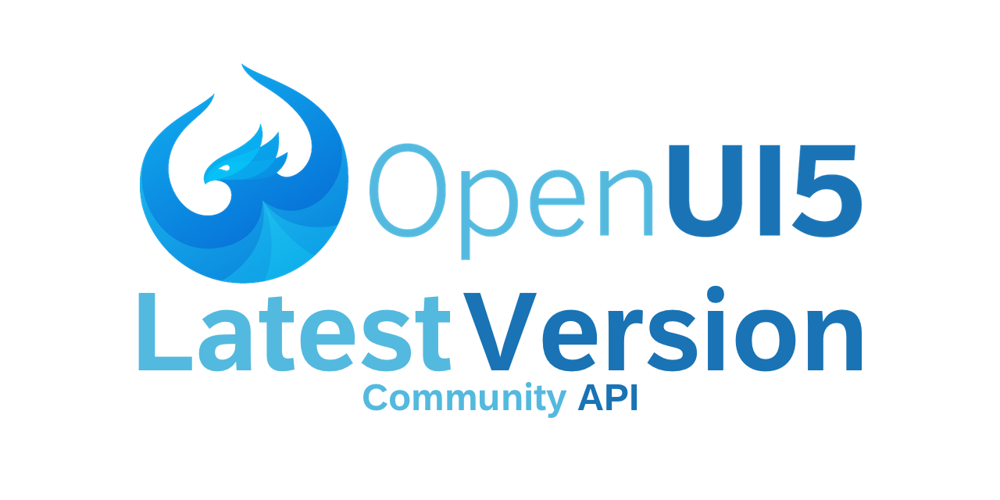

A small webservice that returns url to latest OpenUI5 version. Hosted at https://latest-openui5.rikosjett.com. Version URLs are collected from https://openui5.org/releases/. This API only serves URLs to the official downloads. API call with only type specified, returns the url as a string. When adding format=json, it returns a richer response.

## Endpoints

API host: `https://latest-openui5.rikosjett.com`

### Get latest

**URL**: `/api/v1/latest`

**Method**: `GET`

**Query options**:
* type: sdk | runtime | runtimeMobile (required)
* format: json (optional)

**Example**: `GET /api/v1/latest?type=runtime&format=json`

#### Success Response

**Code**: `200`

**Returns**: `application/json`

Data example
```json 
{
    "version": "1.65.1",
    "type": "runtime",
    "url": "https://openui5.hana.ondemand.com/downloads/openui5-runtime-1.65.1.zip"
}
```

#### Error Responses

**Type**: Document not found

**Code** `404`

**Returns**: `text/html`

Data example
```
Document not found
```

**Type**: Missing query options

**Code**: `400`

**Returns**: `text/html`

Data example
```
Missing type query.
```

### Get latest major.minor

**URL**: `/api/v1/latest/major.minor`

**Method**: `GET`

**Query options**:
* type: sdk | runtime | runtimeMobile (required)
* format: json (optional)

**Example**: `GET /api/v1/latest/1.52?type=runtime&format=json`

#### Success Response

**Code**: `200`

**Returns**: `application/json`

Data example
```json 
{
    "version": "1.52.27",
    "type": "runtime",
    "url": "https://openui5.hana.ondemand.com/downloads/openui5-runtime-1.52.27.zip"
}
```

#### Error Responses

**Type**: Document not found

**Code** `404`

**Returns**: `text/html`

Data example
```
Document not found
```

**Type**: Missing query options

**Code**: `400`

**Returns**: `text/html`

Data example
```
Missing type query.
```

## Disclaimer
I have no affiliation to the [OpenUI5](https://openui5.org) team or [SAP AG](https://www.sap.com). This API is provided as a service to the OpenUI5 community.